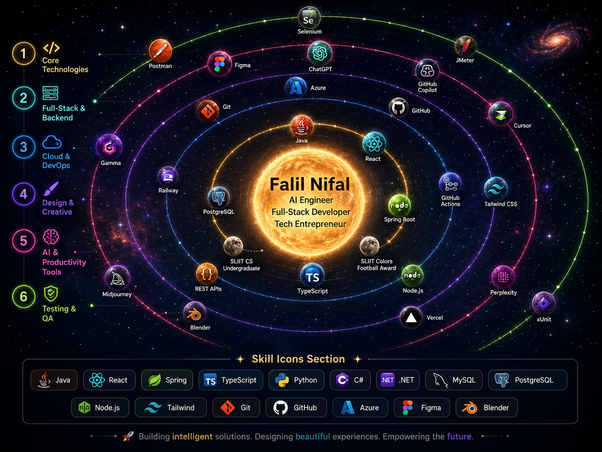

<!--
  GitHub Profile README for Falil Nifal
  Place this README.md inside a public repository named exactly: FalilNifal
  Keep the image inside: assets/cosmic-skill-map.png
-->

  

<h1 align="center">Hi, I'm Falil Nifal 👋</h1>

<h3 align="center">
  Software Engineering Intern · Full-Stack Developer · AI Engineering Enthusiast
</h3>

  <a href="mailto:falilnifal6@gmail.com">Email</a> ·
  <a href="https://github.com/FalilNifal">GitHub</a> ·
  <a href="https://www.linkedin.com/in/Falil-Nifal">LinkedIn</a>

---

## 👨‍🚀 About Me

I’m **Falil Nifal**, a Computer Science undergraduate at **SLIIT**, passionate about full-stack development, AI-powered products, and building practical software that solves real problems.

I enjoy working across the complete software development lifecycle — from requirements gathering and UI/UX design to backend development, testing, deployment, and continuous improvement. My profile combines software engineering, design creativity, AI productivity tools, and an entrepreneurial mindset through my work with **Nexus Grow**.

---

## 🚀 Currently Exploring

- Building full-stack applications with **React, Spring Boot, ASP.NET Core, TypeScript, and PostgreSQL**
- AI-assisted development workflows using **ChatGPT, Claude, GitHub Copilot, Cursor, and Perplexity**
- Cloud deployment and CI/CD using **Azure, GitHub Actions, Vercel, and Railway**
- Software quality practices including **Selenium E2E, Postman, JMeter, xUnit, and defect tracking**
- Creating user-friendly digital products with strong UI/UX and clean frontend experiences

---

## 🧰 Tech Stack

  

### Core Technologies

  
  
  
  
  

### Full-Stack, Cloud & QA

  
  
  
  
  
  
  

---

## 🛰️ Featured Projects

### 🔹 Hardware Store Management System

**ASP.NET Core 8 · React 19 · TypeScript · MySQL · Azure · Selenium E2E · xUnit · JMeter · GitHub Actions · Jira**

A full-stack ERP-style platform built to digitise and streamline hardware retail operations, including inventory tracking, supplier management, sales processing, invoice handling, and financial reporting.

- Implemented RESTful APIs with **JWT authentication** and **role-based access control**
- Built a modern React frontend with TypeScript for inventory, supplier, sales, and invoice modules
- Designed and executed **Postman API tests, Selenium E2E automation, xUnit tests, and 100-user JMeter load tests**
- Managed defect tracking and sprint workflow using **Jira**
- Configured **GitHub Actions CI/CD** deployment workflow to Azure

### 🔹 Restaurant Management System

**Java · Spring Boot · React 18 · PostgreSQL · JWT · Tailwind CSS · Radix UI · Framer Motion · Railway · Vercel**

A multi-role restaurant platform designed to streamline table reservations, order management, payment handling, and admin operations.

- Built Spring Boot REST APIs with **JWT authentication** and role-based access
- Developed a responsive React frontend with an interactive seating map, pre-ordering, and admin dashboard
- Integration-tested 10+ API endpoints using **Postman**
- Validated PostgreSQL data integrity using SQL queries
- Deployed frontend to **Vercel** and backend to **Railway**

### 🔹 IoT Surveillance & Access Control System

**ESP32 · Embedded C · RFID · PIR Sensors · Relay Control**

An embedded system designed for real-time access control and surveillance.

- Programmed ESP32 in Embedded C
- Integrated RFID and PIR sensors for authentication and motion detection
- Implemented relay-controlled door locking with reliable sub-second response times

### 🔹 AI Code Corrector

**Figma · UI/UX Design · Material Design · AI Product Concept**

A mobile UI/UX concept for an AI-powered code correction tool.

- Designed 15+ mobile screens in Figma
- Covered onboarding, error highlighting, and AI-generated suggestion flows
- Applied Material Design principles for a clean and developer-friendly user experience

### 🔹 Modular C Tic-Tac-Toe

**C · Algorithm Design · Minimax AI · Modular Architecture**

A dynamic N×N board game engine built in C with Player vs AI mode.

- Implemented AI logic using the minimax algorithm
- Applied modular architecture and clean code principles
- Designed the system to support flexible board sizes

---

## 🤖 AI & Productivity Stack

I actively use AI and productivity tools to speed up development, research, design, documentation, and problem-solving.

  
  
  
  
  
  
  

---

## 📊 GitHub Analytics

  

  

  

---

## 🌌 Contribution Universe

  

---

## 🏆 Beyond Code

- 🎓 **BSc Computer Science Undergraduate** at SLIIT, expected graduation in 2027
- ⚽ **SLIIT Colors Award — Football 2025** recipient
- 🚀 **UI/UX Designer & Frontend Developer** at Nexus Grow
- 🎨 Interested in design, branding, video creativity, and digital product experiences
- 🤖 Long-term focus: becoming a strong **AI Engineer** who can build intelligent real-world products

---

## 🌍 Connect With Me

  
  
  

---

  🚀 Building intelligent solutions · Designing beautiful experiences · Growing into the future of AI engineering

